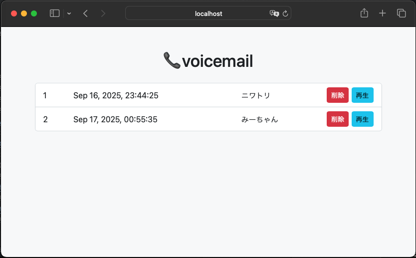

# voicemail
SIP Client with Voicemail for Mikrotik Router Containers.

## Features
- Voicemail
- Speech to Text (Google, AssemblyAI)
- AWS Simple Notification Service

## License
The source code is licensed MIT. The website content is licensed CC BY 4.0,see LICENSE.